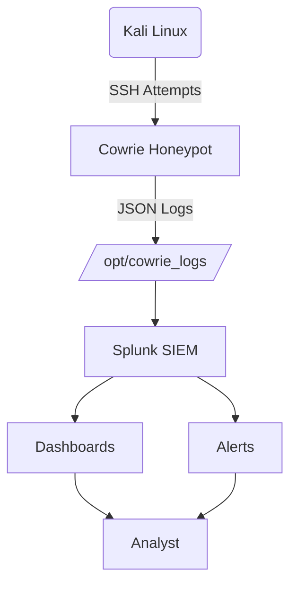

# 🛡️ Honeypot Attack Detection & SIEM Monitoring with Cowrie + Splunk

## 📌 Overview
This project demonstrates a **real-time attack detection and monitoring pipeline** using:

- A **Cowrie SSH Honeypot**
- A simulated **attacker machine (Kali Linux)**
- A **Splunk SIEM instance** for log ingestion, analysis, dashboards, and alerts

The objective was to **simulate real attacker behavior**, capture telemetry, analyze events, and generate insights similar to a Security Operations Center (SOC) workflow.

---

## 🎯 Project Objectives

- Deploy a honeypot safely in an isolated lab  
- Simulate brute-force SSH attacks  
- Capture attacker behavior in real time  
- Stream logs to Splunk using Docker volumes  
- Build dashboards and alerts in Splunk  
- Demonstrate hands-on SOC investigation workflow  

---

## 🧰 Tools & Technologies

| Category | Technology |
|---|---|
| Honeypot | Cowrie |
| SIEM | Splunk |
| Attacker | Kali Linux |
| Container | Docker |
| OS | Ubuntu |
| Log Format | JSON |
| Analysis | SPL (Splunk) |

---

## 🖥️ Virtual Environment Setup

### Virtual Machines

| VM | OS | Purpose |
|---|---|---|
| Honeypot | Ubuntu | Cowrie + log streaming |
| Splunk | Ubuntu | SIEM analysis |
| Attacker | Kali Linux | Attack simulation |

### Networking

| VM | Adapter 1 | Adapter 2 |
|---|---|---|
| Honeypot | NAT | Host-only |
| Splunk | NAT | Host-only |
| Kali | N/A | Host-only |

### Rationale

- NAT for internet + updates  
- Host-only for a safe, isolated attack surface  

---

# 🏗️ Architecture




# 🐍 Cowrie Honeypot Deployment (GHCR + Docker Volume)

This section documents the setup of the Cowrie SSH honeypot using Docker, with real-time log streaming to the host machine.

---

## 📁 Create Host Directory for Logs

```bash
sudo mkdir -p /opt/cowrie_logs
sudo chmod -R 777 /opt/cowrie_logs
```

## 🏗️ Deploy Cowrie Container with Volume Mapping

```
sudo docker run -d \
  --name cowrie \
  -p 2222:2222 \
  -v /opt/cowrie_logs:/cowrie/cowrie-git/var/log/cowrie \
  ghcr.io/cowrie/cowrie:latest
  ```
This command:

- Runs Cowrie in a container
- Exposes SSH on port 2222
- Maps container logs to /opt/cowrie_logs on the host

## 🔍 Verify Container Status

```
sudo docker ps
```
Output


## 📡 Real-Time Log Streaming

Cowrie writes logs directly to the host at:

```
/opt/cowrie_logs/cowrie.json
```
View live events
```
tail -f /opt/cowrie_logs/cowrie.json
```
Output


Logs are stored in JSON format, ideal for SIEM ingestion.

## 🔐 SSH Attack Simulation (Kali Linux)

This phase involves generating SSH brute-force attacks from Kali to the honeypot to produce log events.

##  Manual SSH Login Attempts

```
ssh -p 2222 root@192.168.56.102
```
Output


Tried random passwords like:

```
admin
root
test
123456
password
```
## 📝 Sample Captured Event

```
{
 "eventid": "cowrie.login.failed",
 "username": "root",
 "password": "admin123",
 "src_ip": "192.168.56.103",
 "timestamp": "2024-12-05T17:32:10Z"
}
```

## 📊 Splunk Ingestion 
In Splunk UI:


Add Data → Monitor File

```
Settings → Add Data → Monitor → Files & Directories

```
Add the file path:
```
/opt/cowrie_logs/cowrie.json
```


Set Source Type
```
_json
```
create Index
```
honeypot
```
Verify Ingestion
```
Search & Reporting
```
Run
```
source="/opt/cowrie_logs/cowrie.json" host="nikhil-splunk" index="honeypot" sourcetype="_json"
```


# ....🚧 Work in progress: upcoming updates will include Splunk dashboards, detection queries, and in-depth analysis of attacker behavior.


